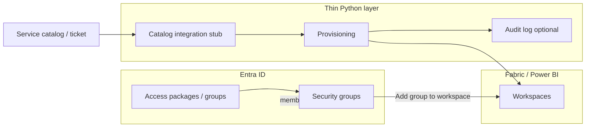

# Fabric control plane — thin custom layer

This repository documents how a **large organization** should split responsibility between **Microsoft Entra governance** and a **small, API-driven Python service**. The goal is **boring automation**: provisioning and hooks, not a full internal Fabric admin product.

## Principles

### 1. Policy lives in Entra

- **Groups** are the primary handle for “who may use which workspace role.”
- **Access packages** and **lifecycle** (joiner/mover/leaver, access reviews) stay in **Entra ID governance** where possible.
- The custom app **does not** reimplement IAM catalogs, approvals, or certification — it **consumes** outcomes (e.g. group membership already correct, or a ticket ID that approved a change).

### 2. Fabric / Power BI: groups on workspaces; SPNs only where needed

- Prefer **adding Entra security groups** to workspaces (Admin / Member / Contributor / Viewer) and managing membership in **Entra**.
- Use **service principals (SPNs)** only for **automation** (pipelines, unattended jobs). Each SPN should be **scoped**, **documented**, and allowed by **tenant developer/admin** settings per Microsoft Learn.
- Workspace **item-level** SQL permissions (e.g. warehouse `GRANT`) remain a **data-plane** concern; this toolkit focuses on **workspace membership** and **orchestration hooks**.

### 3. Custom code only for

| Concern | Role of this repo |
|--------|-------------------|
| **Provisioning** | Create workspaces ([Fabric Core Create Workspace](https://learn.microsoft.com/en-us/rest/api/fabric/core/workspaces/create-workspace)), apply **default group** role assignments ([Add Workspace Role Assignment](https://learn.microsoft.com/en-us/rest/api/fabric/core/workspaces/add-workspace-role-assignment)), optional `capacityId` / `domainId`. |
| **Integration** | Pluggable **stub** for ticket/catalog systems (HTTP webhook or “no-op”). |
| **Reporting / auditing** | Optional **structured logs** (JSON lines) for who called what; extend to your SIEM. |

### 4. Keep the surface area small

- **No** embedded analytics UI, **no** full “Fabric console.”
- **CLI + importable library** so CI/CD or a scheduler can call the same code.
- Secrets from **environment** (or your secret store); never committed.

## Data flow (high level)

## APIs in use

- **Fabric Core REST** (`api.fabric.microsoft.com/v1`): primary surface in the shipped app — [Create Workspace](https://learn.microsoft.com/en-us/rest/api/fabric/core/workspaces/create-workspace) and [Add Workspace Role Assignment](https://learn.microsoft.com/en-us/rest/api/fabric/core/workspaces/add-workspace-role-assignment) with `principal.type` = `Group` for Entra groups.
- **Microsoft Graph** (`graph.microsoft.com/v1.0`): optional `GET /groups/{id}` when `VALIDATE_GROUP_IDS_WITH_GRAPH=true` to fail fast on typos (requires appropriate app permissions).
- **Legacy alternative:** [Power BI Groups APIs](https://learn.microsoft.com/en-us/rest/api/power-bi/groups/create-group) on `api.powerbi.com` can create workspaces and add members; the Python package standardizes on Fabric Core for alignment with Fabric-first tenants.

Tenant prerequisites (examples — confirm with your admins):

- Fabric admin portal: **Service principals can use Fabric APIs** / **Service principals can create workspaces** (and related developer settings) scoped to your automation security groups where applicable. See [Fabric developer tenant settings](https://learn.microsoft.com/en-us/fabric/admin/service-admin-portal-developer).
- The Entra app used by this service: permission to **create workspaces** and **add role assignments** on those workspaces (typically via Fabric administrator grants and capacity/domain policy).

## Security notes

- Run with a **dedicated Entra app registration** and **cert or secret** in a vault.
- Grant **least privilege**: only the Fabric / Graph **application** permissions (or approved delegated flows) your org requires for workspace create and optional group validation.
- Log **who** triggered provisioning (service account vs pipeline identity) in your audit sink.

For **governance, day-to-day operations, and security expectations** (no shared root, SPN lifecycle, audit vs execution identity, checklists), see **[GOVERNANCE.md](GOVERNANCE.md)**.

## Out of scope (by design)

- Replacing Entra **Entitlement Management** or **PIM**.
- Interactive user sign-in flows in this package.
- Full data-plane warehouse SQL provisioning (add separate jobs or DBA process if needed).

## Implementation in this repo (`fabric-provisioner`)

- **Package layout:** `src/fabric_provisioner/` — importable library plus thin surfaces.
- **Tooling:** [uv](https://docs.astral.sh/uv/) + `pyproject.toml`; lock with `uv lock`, install with `uv sync --all-groups`.
- **CLI:** `uv run fabric-provision health|create-workspace` (console script `fabric-provision`).
- **HTTP:** `uv run uvicorn fabric_provisioner.api:app` — `POST /v1/workspaces`, `GET /healthz`.
- **Auth:** OAuth 2.0 client credentials in `auth.py` (no MSAL dependency — single token POST).
- **Integration:** `WebhookTicketCatalogPort` POSTs JSON when `INTEGRATION_WEBHOOK_URL` is set; replace with your own `TicketCatalogPort` for queue-based systems.
- **Audit:** stdout JSON lines on every provision step; optional `AUDIT_JSONL_PATH` for append-only files; CLI **`audit-dump`** streams that file to stdout for extraction (`README.md` — Logs and extraction).

See [README.md](../README.md) for environment variables and examples.
