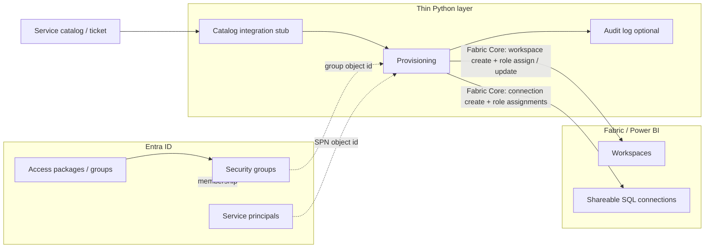

# Fabric control plane — thin custom layer

This repository documents how a **large organization** should split responsibility between **Microsoft Entra governance** and a **small, API-driven Python service** that automates **Fabric Core** provisioning. The goal is **boring automation**: workspaces, shareable SQL connections, and hooks—not a full internal Fabric admin product.

**Scope:** **Fabric administrator** concerns that matter here are **tenant settings** (who may use Fabric APIs, who may create workspaces, optional **admin API** access for service principals), **Entra app permissions** for the provisioner, and **operational** discipline. This doc does **not** cover non-Fabric products or their REST APIs.

**Other docs:** [Documentation index](README.md) · [Get started](get-started.md) · [Usage / examples](usage.md) · [Permissions & least privilege](permissions.md) · [Governance](governance.md) · [Project README](repository.md).

## Principles

### 1. Policy lives in Entra

- **Groups** are the primary handle for “who may use which workspace role.”
- **Access packages** and **lifecycle** (joiner/mover/leaver, access reviews) stay in **Entra ID governance** where possible.
- The custom app **does not** reimplement IAM catalogs, approvals, or certification — it **consumes** outcomes (e.g. group membership already correct, or a ticket ID that approved a change).

### 2. Fabric / Power BI: groups on workspaces; SPNs only where needed

- Prefer **adding Entra security groups** to workspaces (Admin / Member / Contributor / Viewer) and managing membership in **Entra**.
- Use **service principals (SPNs)** only for **automation** (pipelines, unattended jobs). Each SPN should be **scoped**, **documented**, and allowed by **tenant developer/admin** settings per Microsoft Learn.
- Workspace **item-level** SQL permissions (e.g. warehouse `GRANT`) remain a **data-plane** concern; this toolkit focuses on **workspace membership** and **orchestration hooks**.

### 3. Custom code only for

| Concern | Role of this repo |
|--------|-------------------|
| **Provisioning** | Create workspaces ([Fabric Core Create Workspace](https://learn.microsoft.com/en-us/rest/api/fabric/core/workspaces/create-workspace)), apply **default group** and optional **service principal** role assignments ([Add Workspace Role Assignment](https://learn.microsoft.com/en-us/rest/api/fabric/core/workspaces/add-workspace-role-assignment)), **update** an existing workspace role assignment’s role ([Update Workspace Role Assignment](https://learn.microsoft.com/en-us/rest/api/fabric/core/workspaces/update-workspace-role-assignment); caller must be workspace **admin**; uses Fabric **assignment** id, not Entra principal id), and optionally create **shareable SQL connections** plus principal grants via [Connections APIs](https://learn.microsoft.com/en-us/rest/api/fabric/core/connections/create-connection). Optional `capacityId` / `domainId` for workspaces. |
| **Integration** | Pluggable **stub** for ticket/catalog systems (HTTP webhook or “no-op”). |
| **Reporting / auditing** | Optional **structured logs** (JSON lines) for who called what; extend to your SIEM. |

### 4. Keep the surface area small

- **No** embedded analytics UI, **no** full “Fabric console.”
- **CLI + importable library** so CI/CD or a scheduler can call the same code.
- Secrets from **environment** (or your secret store); never committed.

## Data flow (high level)

**Flow:** callers pass **Entra object IDs** for workspace and connection assignments; `P` creates workspaces/connections and then POSTs role assignments. **Changing** an existing workspace principal’s role without re-adding the principal uses Fabric’s PATCH on that **role assignment** (assignment UUID from add/list responses). Workspace principals use `Group` / `ServicePrincipal`; connection principals use `User` / `Group` / `ServicePrincipal`.

## APIs in use

- **Fabric Core REST** (`api.fabric.microsoft.com/v1`): [Create Workspace](https://learn.microsoft.com/en-us/rest/api/fabric/core/workspaces/create-workspace), [Add Workspace Role Assignment](https://learn.microsoft.com/en-us/rest/api/fabric/core/workspaces/add-workspace-role-assignment) (`Group` / `ServicePrincipal`), [Update Workspace Role Assignment](https://learn.microsoft.com/en-us/rest/api/fabric/core/workspaces/update-workspace-role-assignment) (PATCH `role` only on an existing assignment; Microsoft documents **Workspace.ReadWrite.All** for delegated callers—match **application** permissions to your client-credentials setup), [Create Connection](https://learn.microsoft.com/en-us/rest/api/fabric/core/connections/create-connection) (shareable cloud **SQL** for warehouse-style servers), and [Add Connection Role Assignment](https://learn.microsoft.com/en-us/rest/api/fabric/core/connections/add-connection-role-assignment) (`User` / `Group` / `ServicePrincipal` + connection roles `Owner` / `UserWithReshare` / `User`).
- **Microsoft Graph** (`graph.microsoft.com/v1.0`): optional `GET /groups/{id}` and `GET /servicePrincipals/{id}` when `VALIDATE_GROUP_IDS_WITH_GRAPH=true` to fail fast on typos (requires appropriate app permissions).
- **Legacy alternative:** [Power BI Groups APIs](https://learn.microsoft.com/en-us/rest/api/power-bi/groups/create-group) on `api.powerbi.com` can create workspaces and add members; the Python package standardizes on Fabric Core for alignment with Fabric-first tenants.

Tenant prerequisites (**Fabric administrators** configure these in the Fabric admin portal; confirm exact values with your org):

- [Developer settings](https://learn.microsoft.com/en-us/fabric/admin/service-admin-portal-developer): e.g. **Service principals can use Fabric APIs**, **Service principals can create workspaces**—scoped to **security groups** where possible, not the whole tenant unless policy requires it.
- If you use **Fabric / Power BI admin REST** paths from the same app: [Enable service principal authentication for admin APIs](https://learn.microsoft.com/en-us/fabric/admin/enable-service-principal-admin-apis) (security group + **Admin API settings** toggles; supported APIs are listed in Microsoft Learn).
- The **provisioner** Entra app: delegated or application permissions your org approves for **create workspace**, **connections**, and **role assignments** (see each API’s “Required permissions” in Microsoft Learn); optional Graph permissions if `VALIDATE_GROUP_IDS_WITH_GRAPH=true`.

## Security notes

- Run with a **dedicated Entra app registration** and **cert or secret** in a vault.
- Grant **least privilege**: Fabric / Graph permissions your org requires for workspace create, **connections** (`Connection.ReadWrite.All` or as approved), and optional group/SPN validation.
- Log **who** triggered provisioning (service account vs pipeline identity) in your audit sink.

For **required permissions**, **workspace Admin vs automation identity**, and **least privilege**, see **[permissions.md](permissions.md)**. For **governance, day-to-day operations, and security expectations** (no shared root, SPN lifecycle, audit vs execution identity, checklists), see **[governance.md](governance.md)**.

## Out of scope (by design)

- Replacing Entra **Entitlement Management** or **PIM**.
- Interactive user sign-in flows in this package.
- Full data-plane warehouse SQL provisioning (add separate jobs or DBA process if needed).

## Implementation in this repo (`fabric-provisioner`)

- **Package layout:** `src/fabric_provisioner/` — importable library plus thin surfaces.
- **Tooling:** [uv](https://docs.astral.sh/uv/) + `pyproject.toml`; lock with `uv lock`; from the repo root **`just sync`** runs `uv sync --all-groups` (see **`justfile`** and [CONTRIBUTING.md](https://github.com/calvinchengx/fabric/blob/main/CONTRIBUTING.md#short-commands-with-just)).
- **CLI:** **`just cli …`** forwards to **`fabric-provision`** — e.g. **`just health`**, **`just cli create-workspace …`**, **`just cli update-workspace-role …`**, **`just cli create-sql-connection …`**, **`just cli audit-dump`** (without **just:** `uv run fabric-provision …`).
- **HTTP:** **`just api`** runs **`uvicorn`** on **127.0.0.1:8080** by default (**`just api PORT`** to change port). Endpoints: `POST /v1/workspaces`, `PATCH /v1/workspaces/{workspace_id}/role-assignments/{assignment_id}`, `POST /v1/connections/sql`, `GET /healthz`; OpenAPI at `/docs` and `/redoc` while the server runs.
- **Auth:** OAuth 2.0 client credentials in `auth.py` (no MSAL dependency — single token POST).
- **Integration:** `WebhookTicketCatalogPort` POSTs JSON when `INTEGRATION_WEBHOOK_URL` is set; replace with your own `TicketCatalogPort` for queue-based systems.
- **Audit:** stdout JSON lines (`workspace.*` including `workspace.role_assignment_updated`, `connection.sql.created`, `connection.role_assigned`, …); optional `AUDIT_JSONL_PATH`; CLI **`audit-dump`** streams that file to stdout (root **README** — Logs and extraction).

See [repository.md](repository.md) (links to the root README) for environment variables and examples.
