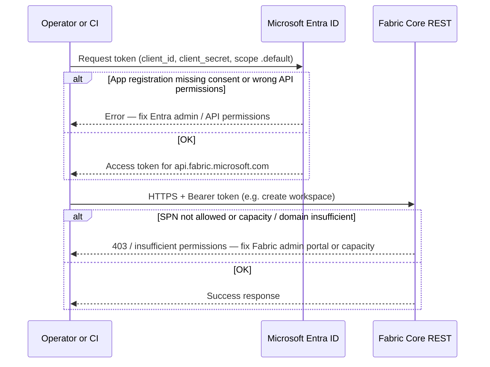
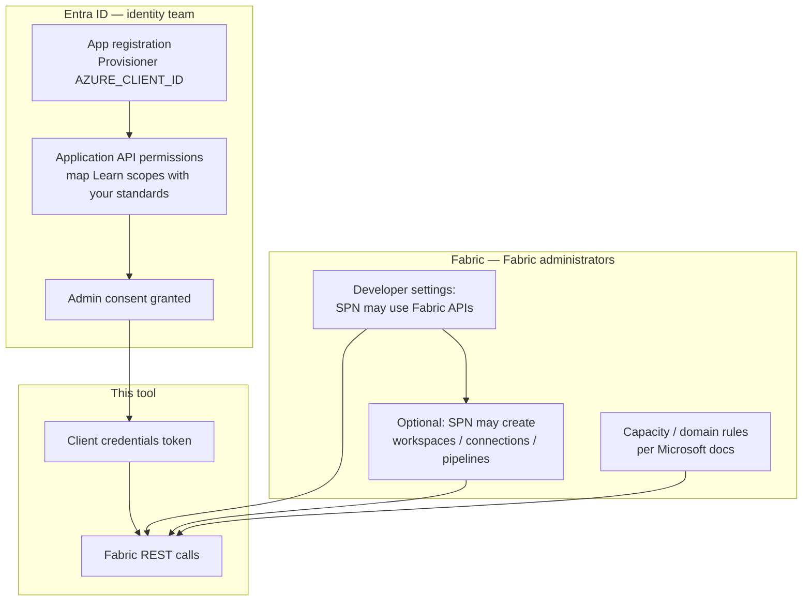
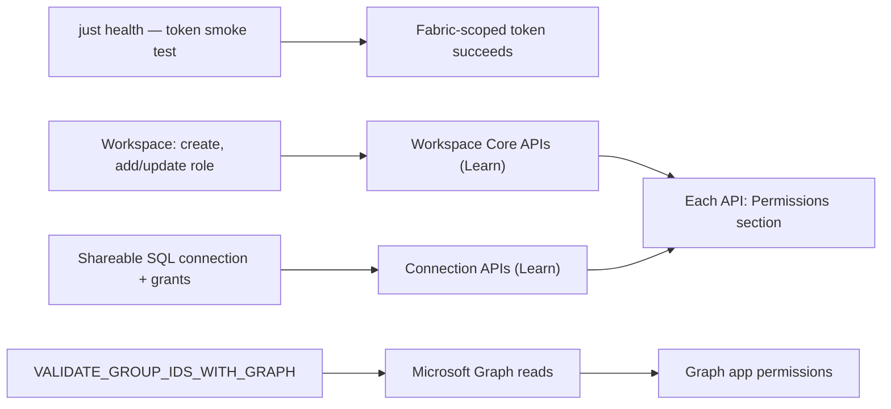
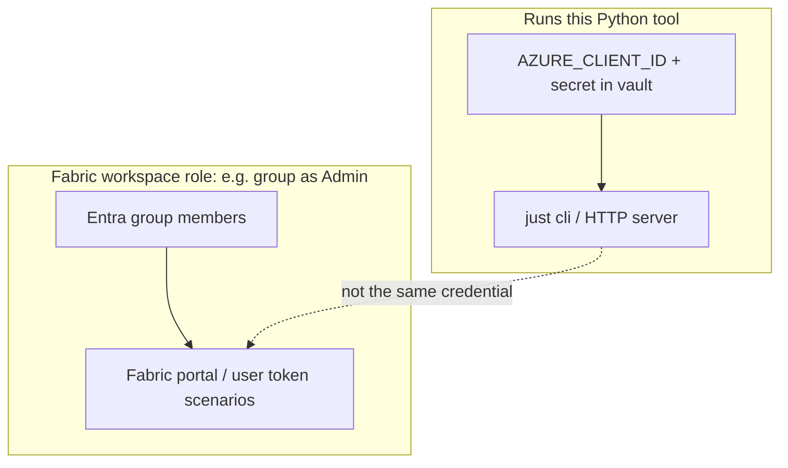

# Permissions and least privilege

This page explains **what must be true in Entra and Fabric** for **`fabric-provisioner`** to work, and how that relates to **workspace “admins”**—without conflating **Fabric workspace roles** with **tenant-wide automation power**.

**Related:** [get-started.md](get-started.md) (install and first **`just health`**) · [architecture.md](architecture.md) (APIs and tenant settings) · [governance.md](governance.md) (operations and checklists) · [usage.md](usage.md) (how to run the tool).

---

## Visual summaries

The diagrams below are **conceptual**. Authoritative **permission names and capacity rules** are always on each operation in [Microsoft Learn](https://learn.microsoft.com/en-us/rest/api/fabric/core/workspaces/create-workspace) (see the table in [Two separate control planes](#2-microsoft-entra-app-permissions-api-permissions)).

### Each Fabric call: token + tenant policy

`fabric-provisioner` always uses **client credentials**. Entra must issue a token **app permissions must be granted**); Fabric must accept calls from that service principal **tenant developer settings + capacity rules**.

### Two control planes (both must allow your SPN)

### Features in this repo → where to look up permissions

### Workspace Admin (Fabric) vs provisioner app (automation)

Humans use **their** identity in Fabric (solid path inside **members**). The dashed link reminds you that **workspace Admin** does **not** grant the **provisioner** app secret or **`just cli`** access.

---

## How this tool authenticates

- The CLI and HTTP server use **OAuth 2.0 client credentials** only: the identity is always the **Entra application** configured as **`AZURE_CLIENT_ID`** (plus secret or certificate material your org injects at runtime).
- Tokens target **`FABRIC_API_SCOPE`**, by default **`https://api.fabric.microsoft.com/.default`** (see the root [README configuration](https://github.com/calvinchengx/fabric/blob/main/README.md#configuration)).
- There is **no interactive user sign-in** in this package. **Humans** do not “log in” through this app; **operators** run a process that presents the **provisioner** app’s credentials.

So: **every** Fabric operation the tool performs is attributed to **one** service principal (per environment), unless you deliberately change **`AZURE_*`** to point at a **different** app registration.

---

## Two separate control planes (both matter)

### 1. Fabric admin portal (tenant settings)

A **Fabric administrator** must allow your automation identity to call Fabric APIs and (where needed) **create** workspaces, **connections**, and related artifacts. Microsoft documents this under **Developer** / **tenant** settings—for example:

- [Service principals can use Fabric APIs](https://learn.microsoft.com/en-us/fabric/admin/service-admin-portal-developer)
- [Service principals can create workspaces, connections, and deployment pipelines](https://learn.microsoft.com/en-us/fabric/admin/service-admin-portal-developer#service-principals-can-create-workspaces-connections-and-deployment-pipelines)

Your org should scope these toggles to **security groups** of service principals where possible, rather than the whole tenant, when policy allows.

**Capacity:** Some operations (for example **creating a workspace** assigned to a capacity) also require the caller to meet Microsoft’s **capacity** requirements—see the **Permissions** section on each API (e.g. [Create Workspace](https://learn.microsoft.com/en-us/rest/api/fabric/core/workspaces/create-workspace)).

### 2. Microsoft Entra app permissions (API permissions)

Service principals obtain access through **admin-consented** permissions on the **app registration**. Microsoft Learn usually lists **delegated** scopes per API (for example **`Workspace.ReadWrite.All`** on workspace operations). With **client credentials**, your tenant admin must grant the **application** permissions your org and Microsoft require for that resource—**names and availability can change**; treat the **“Required permissions” / “Required Delegated Scopes”** block on each operation as the source of truth and map to **application** permissions with your identity team:

| What this repo calls | Microsoft Learn (verify “Permissions” on each page) |
|----------------------|------------------------------------------------------|
| Create workspace | [Create Workspace](https://learn.microsoft.com/en-us/rest/api/fabric/core/workspaces/create-workspace) |
| Add workspace role assignment | [Add Workspace Role Assignment](https://learn.microsoft.com/en-us/rest/api/fabric/core/workspaces/add-workspace-role-assignment) |
| Update workspace role assignment | [Update Workspace Role Assignment](https://learn.microsoft.com/en-us/rest/api/fabric/core/workspaces/update-workspace-role-assignment) |
| Create connection | [Create Connection](https://learn.microsoft.com/en-us/rest/api/fabric/core/connections/create-connection) |
| Add connection role assignment | [Add Connection Role Assignment](https://learn.microsoft.com/en-us/rest/api/fabric/core/connections/add-connection-role-assignment) |

**Connections** often involve Microsoft’s broader **Connection.ReadWrite.All** (or org-approved equivalents) in addition to Fabric portal settings—confirm on the **Create Connection** / role-assignment pages above.

**Optional Microsoft Graph** (only if **`VALIDATE_GROUP_IDS_WITH_GRAPH=true`**): the app calls `GET /groups/{id}` and `GET /servicePrincipals/{id}`. That requires **read** permissions consistent with your standards—commonly **`Group.Read.All`** and **`Application.Read.All`** (or **`Directory.Read.All`** where policy allows). See [governance.md](governance.md#entra-app-registrations-used-by-this-repo).

Supported identities for Fabric Core are summarized in **[Identity support for the Microsoft Fabric REST APIs](https://learn.microsoft.com/en-us/rest/api/fabric/articles/identity-support)**.

---

## Does creating a “workspace Admin” let someone run all tool commands?

**Not automatically, and not in the sense of Entra Global Administrator.**

- **`Admin` / `Member` / `Contributor` / `Viewer` in this tool** are **Fabric workspace roles**. They control what a **principal** can do **inside that workspace** in Fabric (and what that principal can do via Fabric APIs **when authenticated as that principal**).
- This **provisioner** still runs as **`AZURE_CLIENT_ID`**. Assigning your **personal account** or a **group** as **workspace Admin** does **not** give those users this app’s **client secret** or the ability to run **`just cli …` / `fabric-provision`** unless they have access to the **same credential material** and runtime.
- If **`create-workspace`** adds an Entra **group** with **`--group-role Admin`**, members of that group become **workspace administrators** in the **Fabric portal** for **that workspace** (manage membership, settings, items—per Microsoft’s product behavior). They manage Fabric **interactively** as themselves (or as an identity Microsoft recognizes), **not** by inheriting the provisioner’s automation identity.

### Can we use a second service principal “admin” for everything later?

- **This repo does not create or register** a new Entra app. If you want a **different** automation identity later, an admin **creates** another app registration, grants permissions, adds it to the right **Fabric** and **capacity** policies, and you point **`AZURE_CLIENT_ID`** / secret at that app—**or** you run a **separate** deployment with those credentials.
- Putting **SPN B** on a workspace as **Admin** makes **SPN B** a **workspace** admin for **that** workspace **when** SPN B obtains a Fabric token. It does **not** by itself grant **SPN B** tenant-wide **workspace creation** unless Microsoft and your **portal settings** also allow that for **SPN B**’s app registration (same as the provisioner).

**Least-privilege pattern many teams use:**

1. **Provisioner SPN (narrow):** permissions and portal scope **only** to create workspaces/connections and assign roles your pipeline is allowed to perform—ideally **one SPN per environment** (dev/test/prod).
2. **Human governance:** workspace administration for day-to-day work owned by **named people** via **Entra groups** as workspace **Admin** / **Member**, etc.
3. **Workload automation SPNs:** separate apps **per workload**, often only **Member** or **Contributor** on specific workspaces—not every automation account needs **tenant-wide** create or **Admin** on every workspace.

Avoid a single **mega-SPN** that can create arbitrary workspaces **and** hold **Owner** on every connection **and** **Admin** on every workspace unless your risk review explicitly accepts that blast radius.

---

## Summary

| Question | Answer |
|----------|--------|
| What identity runs the tool? | The Entra app behind **`AZURE_CLIENT_ID`** (client credentials). |
| What must Fabric admins configure? | Tenant **developer** settings so that app’s service principal may use Fabric APIs and create resources your jobs require; **capacity** rules per Microsoft docs. |
| What must Entra admins configure? | **Application** permissions (and admin consent) aligned with each Fabric/Graph API you call; optional Graph read permissions for ID validation. |
| If we assign `Admin` on a workspace, can that identity run this CLI for all commands? | **Workspace Admin** governs **that workspace in Fabric**, not possession of **this** app’s secret. **Users** use Fabric as themselves; **automation** still needs an app registration + secret (this one or another you configure). |
| Least privilege? | Minimize provisioner permissions; prefer **groups** for people; separate **SPNs** per environment and per workload where practical; scope Fabric portal settings to **groups** of allowed SPNs. |

For day-to-day operational rules, see **[governance.md](governance.md)**.
